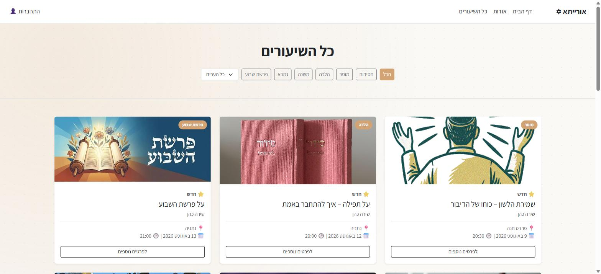
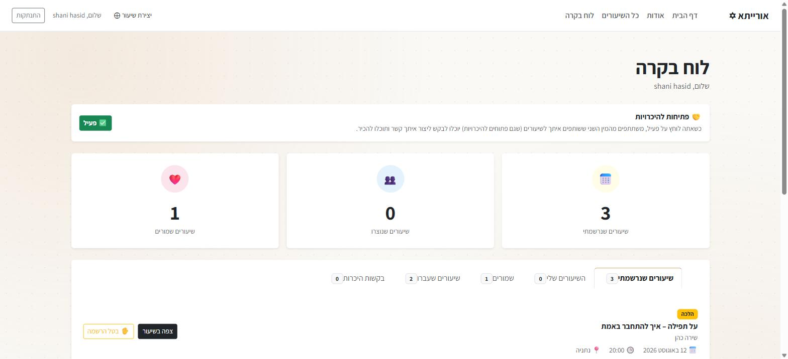
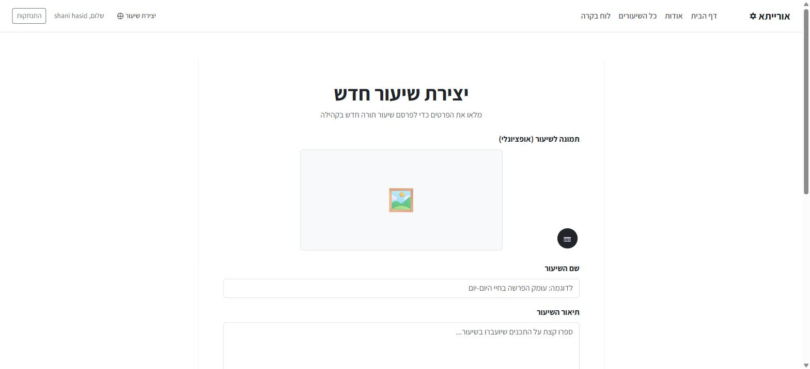

# אורייתא — Torah Lessons Platform

A full-stack web application for browsing, creating, and registering for Torah lessons in the community. Users can register/login (including Google Sign-In), browse and filter lessons, join classes, save favorites, leave comments, rate lessons they attended, and — as the lesson creator — create and edit their own lessons with an uploaded image. Participants who share a lesson and are both opted in can also send each other a consent-gated introduction request — see "Match Requests" below.

Built as a **solo** final project for the **Advanced Full Stack** course.

---

## Live Demo

Try it live: 🔗 https://oraita.vercel.app

---

## Screenshots

All screenshots below are from the live site at [oraita.vercel.app](https://oraita.vercel.app).

| HomePage | All Lessons |
|---|---|
|  |  |

| Single Lesson | Dashboard |
|---|---|
|  |  |

| Create Lesson |
|---|
|  |

---

## Team

**Shani Hassid** — solo developer (backend, frontend, database, deployment)

---

## Tech Stack

| Layer | Technology |
|-------|-----------|
| Frontend | React 19 + TypeScript + Vite |
| State management | Context API (auth) + Redux Toolkit (lessons) |
| HTTP client | Axios (instance with token-injection + 401-redirect interceptors) |
| Backend | Node.js + Express 5 + TypeScript |
| Database | MongoDB + Mongoose 9 |
| Authentication | JWT (access token 1h + refresh token 7d) + bcrypt + Google Sign-In (`google-auth-library`) |
| Validation | JOI (server-side, all POST/PATCH bodies) |
| Security | Helmet + express-rate-limit (general + stricter auth limiter) |
| File upload | Multer (in-memory buffer) → **Cloudinary** (images are never written to local disk) |
| UI | Bootstrap 5 + custom CSS variables (gold theme, full RTL Hebrew) |
| React patterns | Custom hooks (`src/hooks/`), reusable components, `React.memo`, lazy-loaded routes |

---

## Features

- **Register / Login** — email+password or Google Sign-In, JWT auth with refresh-token rotation, session restored on page refresh via `/api/users/me`
- **Browse lessons** — filter by category and city, past lessons automatically hidden from active views
- **Single lesson** — join/leave, toggle favorite, post comments, rate a lesson after it has occurred (1–5 stars, average recomputed live)
- **Create / edit lesson** — image upload to Cloudinary, form validation, creator-only editing (`/editlesson/:id`)
- **Dashboard** — personal view of joined lessons, created lessons, favorites, and a dedicated past-lessons tab (with delete for lessons the user created)
- **Teacher profile** — public page with two tabs (upcoming / past lessons), average rating computed across all of a teacher's lessons, and cities taught
- **Match requests** — the project's "unique feature": participants who share a lesson and are both opted in ("open to introductions") can send each other a short, consent-gated contact request; phone numbers are only ever revealed once the recipient accepts. Opt-in toggle and request inbox live on the Dashboard.
- **About page** (`/about`) — fully public, no auth required, same as the homepage
- **Protected routes** — client-side (`PrivateRoute`) and server-side (`authMiddleware`), redirect to `/login` and back to the intended page
- **Rate limiting** — 100 req/15min globally, 10 req/15min on `/register` and `/login`
- **Security headers** — Helmet on all responses
- **Loading / error / empty states** throughout, Hebrew-localized validation and auth error messages, custom 404 page

---

## Local Setup

### Prerequisites

- Node.js 18+
- MongoDB running locally (or a MongoDB Atlas connection string)
- A Cloudinary account (free tier) for image uploads
- A Google Cloud OAuth 2.0 Client ID for Google Sign-In

### 1. Clone the repo

```bash
git clone https://github.com/hasidshani/final-project.git
cd final-project
```

### 2. Backend

```bash
# Install backend dependencies (from project root)
npm install

# Create environment file
cp server/.env.example server/.env
# Edit server/.env — fill in TOKEN_SECRET, DATABASE_URL, CLOUDINARY_*, GOOGLE_CLIENT_ID

# Start backend in watch mode (port 3000)
npm run dev
```

### 3. Frontend

```bash
cd oraita-web

# Install frontend dependencies
npm install

# Create environment file
cp .env.example .env
# .env already defaults to http://localhost:3000/api — add VITE_GOOGLE_CLIENT_ID for Google login

# Start frontend (port 5173)
npm run dev
```

### 4. Open the app

```
http://localhost:5173
```

---

## Environment Variables

### Backend — `server/.env`

| Variable | Description | Example |
|----------|-------------|---------|
| `PORT` | Server port | `3000` |
| `DATABASE_URL` | MongoDB connection string | `mongodb://localhost/oraita_db` |
| `TOKEN_SECRET` | JWT signing secret | `a_long_random_string` |
| `TOKEN_EXPIRATION` | Access token lifetime | `1h` |
| `REFRESH_TOKEN_EXPIRATION` | Refresh token lifetime | `7d` |
| `CLIENT_URL` | Frontend URL (for CORS) | `http://localhost:5173` |
| `NODE_ENV` | Environment | `development` |
| `CLOUDINARY_CLOUD_NAME` | From cloudinary.com dashboard | — |
| `CLOUDINARY_API_KEY` | From cloudinary.com dashboard | — |
| `CLOUDINARY_API_SECRET` | From cloudinary.com dashboard | — |
| `GOOGLE_CLIENT_ID` | From console.cloud.google.com — required for Google Sign-In; server fails Google logins closed (500) if unset | — |

### Frontend — `oraita-web/.env`

| Variable | Description | Example |
|----------|-------------|---------|
| `VITE_API_URL` | Backend API base URL | `http://localhost:3000/api` |
| `VITE_GOOGLE_CLIENT_ID` | Same Google OAuth Client ID as the backend | — |

---

## API Endpoints

Base URL: `http://localhost:3000/api`

Protected routes require the header:
```
Authorization: Bearer <accessToken>
```

### Users — `/api/users`

| Method | Route | Auth | Description |
|--------|-------|:----:|-------------|
| `GET` | `/me` | ✅ | Get current logged-in user (with favorites array) |
| `POST` | `/register` | ❌ | Register new user (JOI validated, rate limited) |
| `POST` | `/login` | ❌ | Login → returns `accessToken` + `refreshToken` + favorites |
| `POST` | `/logout` | ❌ | Invalidate refresh token |
| `POST` | `/refresh` | ❌ | Exchange refresh token for a new token pair |
| `POST` | `/google` | ❌ | Google Sign-In — verifies credential (`email_verified` + `GOOGLE_CLIENT_ID` audience), finds/creates user, returns tokens |
| `PATCH` | `/phone` | ✅ | Update the logged-in user's phone number |
| `PATCH` | `/match-preference` | ✅ | Toggle `openToMatch` (opt in/out of match requests) |
| `POST` | `/favorites/:lessonId` | ✅ | Add lesson to favorites |
| `DELETE` | `/favorites/:lessonId` | ✅ | Remove lesson from favorites |

### Lessons — `/api/lessons`

| Method | Route | Auth | Description |
|--------|-------|:----:|-------------|
| `GET` | `/` | ❌ | Get all lessons (creator populated) |
| `POST` | `/` | ✅ | Create lesson — JSON body, `image` is a Cloudinary URL string |
| `GET` | `/:id` | ❌ | Get single lesson (creator + participants populated, includes ratings). Participants are populated with `name email openToMatch` only — no phone numbers on this public route |
| `PATCH` | `/:id` | ✅ | Update lesson (creator only) |
| `DELETE` | `/:id` | ✅ | Delete lesson (creator only) |
| `POST` | `/:id/join` | ✅ | Join lesson (checks capacity) |
| `DELETE` | `/:id/join` | ✅ | Cancel registration (leave lesson) |
| `POST` | `/:id/rate` | ✅ | Rate a past lesson 1–5 stars (participants only, after the lesson date) |

### File Upload — `/api/file`

| Method | Route | Auth | Description |
|--------|-------|:----:|-------------|
| `POST` | `/` | ✅ | Upload image → buffered in memory by Multer → streamed to Cloudinary → returns `{ url: "<cloudinary secure_url>" }` |

### Comments — `/api/comments`

| Method | Route | Auth | Description |
|--------|-------|:----:|-------------|
| `GET` | `/lesson/:lessonId` | ❌ | Get all comments for a lesson |
| `POST` | `/:lessonId` | ✅ | Add comment |
| `DELETE` | `/:id` | ✅ | Delete comment (owner only) |

### Match Requests — `/api/matchrequests`

| Method | Route | Auth | Description |
|--------|-------|:----:|-------------|
| `GET` | `/me` | ✅ | Get all match requests (sent or received). Phone numbers are stripped unless the request is `accepted` |
| `POST` | `/:toUserId` | ✅ | Send a request (`{ lessonId, note? }`) — requires both users opted in and both participants of that lesson |
| `PATCH` | `/:id` | ✅ | Accept or decline (`{ status: 'accepted' \| 'declined' }`) — recipient only |

---

## Data Models

### User
| Field | Type | Notes |
|-------|------|-------|
| `name` | String | required |
| `email` | String | required, unique |
| `password` | String | bcrypt hashed |
| `phone` | String | optional |
| `openToMatch` | Boolean | default `false` — opt-in for match requests |
| `favorites` | ObjectId[] | refs to Lesson |
| `refreshTokens` | String[] | active refresh tokens |

### Lesson
| Field | Type | Notes |
|-------|------|-------|
| `title` | String | required |
| `description` | String | required, line breaks preserved |
| `category` | Enum | `חסידות` `מוסר` `הלכה` `משנה` `גמרא` `פרשת שבוע` |
| `city` | Enum | `נתניה` `פרדס חנה` |
| `date` | String | required |
| `time` | String | required |
| `image` | String | Cloudinary `secure_url`, restricted to our cloud name at validation time |
| `creator` | ObjectId | ref to User |
| `participants` | ObjectId[] | refs to User |
| `maxParticipants` | Number | default 50 |
| `rating` | Number | 0–5, computed average |
| `ratings` | Array | `{ user: ObjectId, value: Number }`, one entry per participant |

### Comment
| Field | Type | Notes |
|-------|------|-------|
| `lesson` | ObjectId | ref to Lesson |
| `user` | ObjectId | ref to User |
| `text` | String | required |

### MatchRequest
| Field | Type | Notes |
|-------|------|-------|
| `from` | ObjectId | ref to User (requester) |
| `to` | ObjectId | ref to User (recipient) |
| `lesson` | ObjectId | ref to Lesson — the shared lesson that justifies the request |
| `note` | String | optional, ≤200 chars |
| `status` | Enum | `pending` \| `accepted` \| `declined` |

---

## Project Structure

```
FinalProject/
├── server/                          ← Express backend (TypeScript)
│   ├── app.ts                       ← Express app + middleware + static file serving
│   ├── server.ts                    ← MongoDB connect + server start
│   ├── models/
│   │   ├── users.ts
│   │   ├── lessons.ts
│   │   ├── comments.ts
│   │   └── matchRequests.ts         ← from/to/lesson/note/status
│   ├── controllers/
│   │   ├── userController.ts        ← register, login, logout, refresh, getMe, googleSignin, favorites, updatePhone, updateMatchPreference
│   │   ├── lessonController.ts      ← CRUD + join/leave + rate lesson
│   │   ├── commentController.ts
│   │   └── matchRequestController.ts ← create/respond/list, strips phone unless accepted
│   ├── routes/
│   │   ├── users_routes.ts
│   │   ├── lessons_routes.ts
│   │   ├── comments_routes.ts
│   │   ├── file_routes.ts           ← POST / — authenticated Cloudinary upload
│   │   └── matchRequests_routes.ts
│   ├── middleware/
│   │   ├── authMiddleware.ts        ← JWT verify → req.userId
│   │   ├── validate.ts              ← JOI wrapper
│   │   ├── rateLimiter.ts           ← apiLimiter + authLimiter
│   │   ├── logger.ts
│   │   └── errorHandler.ts
│   └── validation/
│       ├── userValidation.ts
│       ├── lessonValidation.ts      ← includes Cloudinary-domain-restricted image URL check
│       └── matchRequestValidation.ts
├── oraita-web/                      ← React frontend (TypeScript + Vite)
│   └── src/
│       ├── pages/
│       │   ├── HomePage.tsx
│       │   ├── Login.tsx
│       │   ├── Register.tsx
│       │   ├── Dashboard.tsx
│       │   ├── AllLessons.tsx
│       │   ├── CreateLesson.tsx     ← dual-mode create/edit
│       │   ├── SingleLesson.tsx
│       │   ├── TeacherProfile.tsx
│       │   ├── AboutPage.tsx        ← public, no auth (Shani's personal intro to the site)
│       │   └── NotFound.tsx
│       ├── components/
│       │   ├── Navbar.tsx
│       │   ├── Footer.tsx
│       │   ├── Layout.tsx
│       │   ├── LessonCard.tsx
│       │   ├── StatCard.tsx
│       │   ├── CommentCard.tsx
│       │   └── PrivateRoute.tsx
│       ├── context/
│       │   └── AuthContext.tsx
│       ├── store/
│       │   ├── store.ts
│       │   └── lessonsSlice.ts
│       ├── hooks/                   ← useLessons, useDashboard, useSingleLesson, useComments, useTeacherProfile, useMatchRequests
│       ├── utils/
│       │   └── lessonDate.ts        ← shared isLessonUpcoming() helper
│       └── services/
│           └── api.ts               ← Axios instance + interceptors
├── public/                          ← legacy static path, kept for pre-Cloudinary image URLs
└── .env.example files (server + oraita-web) committed; .env never committed
```

---

## Deployment Guide

See `PROGRESS.md` for the full step-by-step deployment guide (MongoDB Atlas → Render → Vercel).
